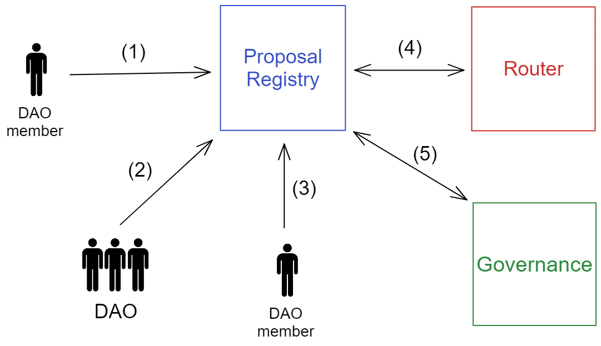

# OuterCircle Protocol Docs

Протокол предназначен для создания удобно масшатбируемых ДАО. Цель проекта -- создать максимально адаптивную инфраструктуру для написания создания, управления, голосований ДАО.

Архитектура проекта состоит из "базовых" контрактов, содержащих минимальный функционал для функционирования ДАО. Ожидается, что сообщество поддержит инициативу стандартизации ДАО и начнёт создавать свои "расширения" и протоколы, наследуясь от контрактов OuterCircle.

Также проект предлагает удобный веб-интерфейс для взаимодействия с ДАО, но это не относится к архитектурной части проекта, поэтому про это будет рассказываться в другом документе.

# Архитектура

Для начала разберемся с контрактами и их функциями. Подробное описание функций смотрите в файлах контрактов.

## Описание контрактов

`ProposalRegistry` -- этот контракт реализует функции создания пропоузала, голосования за пропоузал и выполнения пропоузала. Можно считать, что этот контракт является основным и представляет из себя "само ДАО".

`Router` -- контракт, нужный для проведения "сложных" голосований. "Сложными" называются те голосования, которые вместо тривиального голосования за \ против, позволяют пользователям голосовать за некоторые параметры.

Например, с помощью `Router`-ов можно провести такое голосование, где каждый член ДАО голосует за количество `ETH`, которое стоит обменять на `USDT`, и, если большинство согласно, выбирается средняя сумма. На самом деле при помощи `Router`-ов можно реализовать люблую логику голосований.

`Governance` -- контракт, отвечающий за хранение и изменение голосовательной силы пользователей ДАО. Если в ДАО предусмотренно голосование токенами, то Governance является "обёрткой" над контрактом токена.

Каждому `ProposalRegistry` соответствует только один `Governance`, в то время, как одному `Governance` может соотвествовать много `ProposalRegistry` (например, если одна группа людей управляет несколькими ДАО).

## Логика взаимодействия

**1. Создание пропоузала**

-   То, может человек создавать пропоузал или нет решается в контракте `Governance`
-   Пропоузал это последовательный список транзакций
-   Транзакции бывают двух видов: **обычные** транзакции и **router** транзакции

> `Обычные транзакции` -- те транзакции, поле `data` (контекст вызова) которых не изменяется в процессе голосования. Например, транзакция "переведи 10 ETH на адрес A"

> `Роутер транзакции` -- те транзакции, поле `data` которых изменяется `Router`-ом после каждого голоса за данных пропоузал. Например, транзакция "переведи `<amount>` ETH на адрес А", где `<amount>` вычисляется в процессе голосование, например, как среднее значение, за которое проголосовали пользователи. При помощи `роутер транзакций` можно проводить любые голосования, даже очень сложные, нужно только написать соответствующий `Router`.

**2. Голосование за пропоузал**

-   Возможны голоса трёх типов: `YES`, `NO`, `ABSTAIN`.
-   То, сколько голосов и какого типа нужно, чтобы принять \ отклонить пропоузал решает соответствующая функция в `ProposalRegistry`.
-   Допуск определённого человека к голосованию и силу его голоса определяется в контракте `Governance`.
-   Если пропоузал не был принят за определённое время (которое регулируется `ProposalRegistry`), то он считается `просроченным` и не может быть выполнен.
-   Человек или контракт (если в `Governance` предусмотрена для него такая возможность) может наложить `вето` на пропоузал, после чего он считается автоматически `отклонённым`.
-   После того как пропоузал был принят, его можно выполнить

**3. Выполнение пропоузала**

-   Невозможно выполнить отклонённые или просроченные пропоузалы.
-   Выполнить пропоузал может только тот человек, у которого есть соответствующее разрешение в `Governance`.
-   Выполнение пропоузала подразумевает последовательный вызов всех его транзакций и соответствующую плату за газ.
-   Отправителем транзакций будет считаться `ProposalRegistry`.
-   Чтобы управлять ДАО через систему пропоузалов, необходимо дать `ProposalRegistry` возможность вызывать "управленческие" функции своего контракта (например, если вы используете `Ownable` из `openzeppelin`, нужно сделать `ProposalRegistry` owner-ом контракта).

**4. Обращение к `Router`**

Если одна транзакция в пропоузале `роутерная`, а не `обычная`, тогда

-   Каждый раз когда кто-то голосует за этот пропоузал, `ProposalRegistry` обращается к роутеру и отправляет данные, за которые проголосовал пользователь
-   `Router` возвращает новую `data` (контекст вызова) транзакции. По сути это значит, что `Router` переписывает транзакцию при каждом голосовании
-   Когда голосование завершено, роутерная транзакция выполняется точно также, как и обычная, уже с новым `data`.
-   Конечно, роутер может и не перезаписывать поле `data`, тогда транзакция не будет ничем отличаться от `обычной`.

**5. Обращение к `Governance`**

Как уже говорилось, этот контракт отвечает за права и голосовательную силу пользователей

-   Если пользователь вызывает любую функцию в `ProposalRegistry`, он должен иметь разрешение на это в `Governance`.
-   Каждое ДАО вольно само решать, каким пользователям давать доступ к взаимодействию с `ProposalRegistry`. Например, выполнять пропоузал можно разрешить вообще всем, а создавать только определённому кругу лиц (например, владельцам токенов ДАО).
-   `Governance` реализует так называемую "систему управления". Если настроить его так, что взаимодействовать с `ProposalRegistry` может только адрес мультисига владельцев протокола, то получится привычная всем `централизованная` модель управления ДАО.
-   Каждое ДАО должно иметь свой `Governance` настроенный конкретно под цели этого ДАО.
